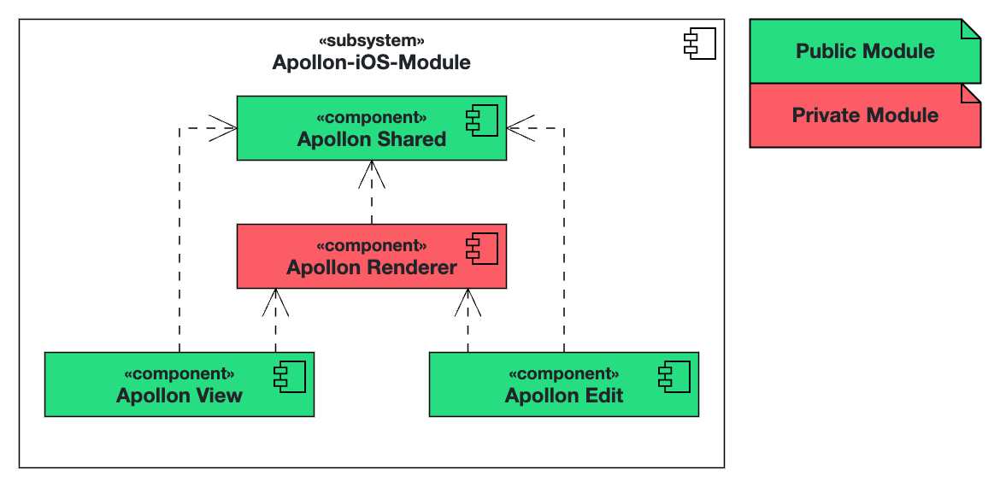

# Apollon iOS Module

Apollon-iOS-Module is a SPM package containing different modules, which allow for creating, editing, and viewing UML diagrams across all Artemis-related iOS apps. This package is based on [Apollon](https://github.com/ls1intum/Apollon).

# Clients Overview

This package will be integrated into the following clients:

- [Artemis iOS](https://github.com/ls1intum/artemis-ios) – Native iOS application for Artemis
- [Themis](https://github.com/ls1intum/Themis) – An iPad app that provides a comprehensive and optimized way for tutors to assess student submissions on the go.
- [Apollon iOS](https://github.com/ls1intum/apollon-ios) - A standalone modeling application that allows users to freely create, edit, and view UML diagrams from the comfort of their iOS device.

# Modules

## Overview

- **ApollonShared**: Contains all data models used by Apollon
- **ApollonRenderer**: Contains all the rendering logic
- **ApollonEdit**: Allows for the editing of UML diagrams
- **ApollonView**: Allows for the viewing of UML diagrams 

## Architecture



*Figure: Subsystem decomposition of the `Apollon-iOS-Module`.*

# Installation Guide

## Swift Package Manager

### Add to Xcode project

In Project Settings, on the tab "Package Dependencies", click "+" and add <https://github.com/ls1intum/apollon-ios-module>

### Add to Package.swift based SPM project

1. Add a dependency in Package.swift:
```swift
dependencies: [
    .package(url: "https://github.com/ls1intum/apollon-ios-module", .upToNextMajor(from: "1.0.0")),
]
```

2. For each relevant target, add a dependency with the product name from section 1:
```swift
.target(
    name: "Example",
    dependencies: [
        .product(name: "ApollonEdit", package: "apollon-ios-module"),
    ]    
)
```

## Usage

### ApollonEdit
```swift
import ApollonEdit

ApollonEdit(umlModel: Binding<UMLModel>,
            diagramType: UMLDiagramType,
            fontSize: CGFloat,
            themeColor: Color,
            diagramOffset: CGPoint,
            isGridBackground: Bool)
```

### ApollonView
```swift
import ApollonView

ApollonView(umlModel: UMLModel,
            diagramType: UMLDiagramType,
            fontSize: CGFloat,
            themeColor: Color,
            diagramOffset: CGPoint,
            isGridBackground: Bool,
            @ViewBuilder content: () -> Content)
```


